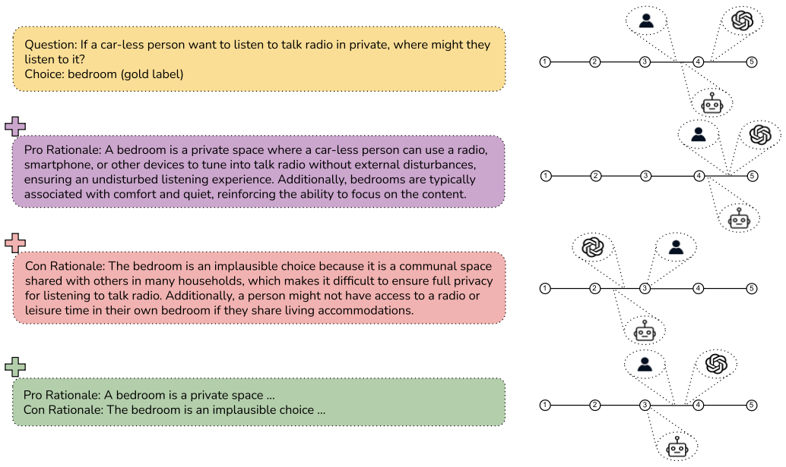

# Everything is Plausible: Investigating the Impact of LLM Rationales on Human Notions of Plausibility
This repository contains the data collected in the paper: [Everything is Plausible: Investigating the Impact of LLM Rationales on Human Notions of Plausibility](https://arxiv.org/abs/2510.08091) presented at [The 64th Annual Meeting of the Association for Computational Linguistics (ACL 2026).](https://2026.aclweb.org)

## Introduction
We adopt the plausibility rating framework introduced in [Plausibly Problematic Questions in Multiple-Choice Benchmarks for Commonsense Reasoning](https://aclanthology.org/2024.findings-emnlp.198/) which was presented at [The 2024 Conference on Empirical Methods in Natural Language Processing (EMNLP 2024).](https://2024.emnlp.org)

We sample a subset of the the questions used in the above paper and use it as our ``NO Rationale`` setting. We use a LLM to generate ``PRO`` and ``CON`` rationales for or against the plausibility of each answer choice. We then collect 3,000 new human plausibility ratings of answer choices, presented alongside either a ``PRO`` rationale of the answer, a ``CON`` rationale, or both, i.e. ``(PRO+CON)``, as shown in the figure below. Please refer to our paper for more details.

<p align="center">
  </img>
</p>

## Data
We release our data as ``.jsonl`` and ``.csv`` files. The data is organized into separate directories for each rationale type as follows:
```
└── data
    └── con
        ├── cqa_human_con.csv
        ├── cqa_human_con.jsonl
        ├── siqa_human_con.csv
        └── siqa_human_con.jsonl
    └── pro
        ├── cqa_human_pro.csv
        ├── cqa_human_pro.jsonl
        ├── siqa_human_pro.csv
        └── siqa_human_pro.jsonl
    └── pro_con
        ├── cqa_human_pro_con.csv
        ├── cqa_human_pro_con.jsonl
        ├── siqa_human_pro_con.csv
        └── siqa_human_pro_con.jsonl
```
An example data point in the ``data/pro/cqa_human_pro.jsonl`` file is shown below:
``` json
{
    "question": "The question text.",
    "gold_label": "The gold label answer choice from the dataset.",
    "gold_label_pro_rationale": "PRO rationale for the gold label as generated by the LLM.",
    "gold_label_ratings": "List of human annotator plausibility ratings for the gold label when the PRO rationale is shown.",
    "feedback_gold_label": "Optional feedback provided by the annotators for the gold label when the PRO rationale is shown.",
    "distractor": "The distractor answer choice from the dataset.",
    "distractor_pro_rationale": "PRO rationale for the distractor as generated by the LLM.",
    "distractor_ratings": "List of human annotator plausibility ratings for the distractor when the PRO rationale is shown.",
    "feedback_distractor": "Optional feedback provided by the annotators for the distractor when the PRO rationale is shown.",
    "gold_label_stats": "Mean, variance, standard deviation and median of the plausibility ratings for the gold label when the PRO rationale is shown.",
    "distractor_stats": "Mean, variance, standard deviation and median of the plausibility ratings for the distractor when the PRO rationale is shown.",
    "gold_label_no_rationale_ratings": "List of human annotator plausibility ratings for the gold label in the NO Rationale setting.",
    "gold_label_no_rationale_stats": "Mean, variance, standard deviation and median of the plausibility ratings for the gold label in the NO Rationale setting.",
    "distractor_no_rationale_ratings": "List of human annotator plausibility ratings for the distractor in the NO Rationale setting.",
    "distractor_no_rationale_stats": "Mean, variance, standard deviation and median of the plausibility ratings for the distractor in the NO Rationale setting."
}
```
The files in the ``con`` and ``pro_con`` directories follow a similar structure.
The above example structure is based on a data point from CommonsenseQA. Please note that Social IQa has an additional ``context`` field.

## License
This project is licensed under the MIT License.
## Citation
If you use this dataset, please cite the following papers:

```
@misc{palta2026plausibleinvestigatingimpactllm,
      title={Everything is Plausible: Investigating the Impact of LLM Rationales on Human Notions of Plausibility}, 
      author={Shramay Palta and Peter Rankel and Sarah Wiegreffe and Rachel Rudinger},
      year={2026},
      eprint={2510.08091},
      archivePrefix={arXiv},
      primaryClass={cs.CL},
      url={https://arxiv.org/abs/2510.08091}, 
}
```
and
```
@inproceedings{palta-etal-2024-plausibly,
    title = "Plausibly Problematic Questions in Multiple-Choice Benchmarks for Commonsense Reasoning",
    author = "Palta, Shramay  and
      Balepur, Nishant  and
      Rankel, Peter A.  and
      Wiegreffe, Sarah  and
      Carpuat, Marine  and
      Rudinger, Rachel",
    editor = "Al-Onaizan, Yaser  and
      Bansal, Mohit  and
      Chen, Yun-Nung",
    booktitle = "Findings of the Association for Computational Linguistics: EMNLP 2024",
    month = nov,
    year = "2024",
    address = "Miami, Florida, USA",
    publisher = "Association for Computational Linguistics",
    url = "https://aclanthology.org/2024.findings-emnlp.198",
    pages = "3451--3473",
}
```

Please also cite the original dataset papers:

```
@inproceedings{sap-etal-2019-social,
    title = "Social {IQ}a: Commonsense Reasoning about Social Interactions",
    author = "Sap, Maarten  and
      Rashkin, Hannah  and
      Chen, Derek  and
      Le Bras, Ronan  and
      Choi, Yejin",
    editor = "Inui, Kentaro  and
      Jiang, Jing  and
      Ng, Vincent  and
      Wan, Xiaojun",
    booktitle = "Proceedings of the 2019 Conference on Empirical Methods in Natural Language Processing and the 9th International Joint Conference on Natural Language Processing (EMNLP-IJCNLP)",
    month = nov,
    year = "2019",
    address = "Hong Kong, China",
    publisher = "Association for Computational Linguistics",
    url = "https://aclanthology.org/D19-1454",
    doi = "10.18653/v1/D19-1454",
    pages = "4463--4473"
}
```


```
@inproceedings{talmor-etal-2019-commonsenseqa,
    title = "{C}ommonsense{QA}: A Question Answering Challenge Targeting Commonsense Knowledge",
    author = "Talmor, Alon  and
      Herzig, Jonathan  and
      Lourie, Nicholas  and
      Berant, Jonathan",
    editor = "Burstein, Jill  and
      Doran, Christy  and
      Solorio, Thamar",
    booktitle = "Proceedings of the 2019 Conference of the North {A}merican Chapter of the Association for Computational Linguistics: Human Language Technologies, Volume 1 (Long and Short Papers)",
    month = jun,
    year = "2019",
    address = "Minneapolis, Minnesota",
    publisher = "Association for Computational Linguistics",
    url = "https://aclanthology.org/N19-1421",
    doi = "10.18653/v1/N19-1421",
    pages = "4149--4158"
}
```
